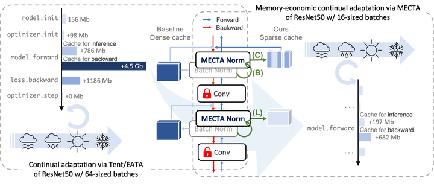

# MECTA: Memory-Economic Continual Test-time Adaptation

This repository implements the paper: "MECTA: Memory-Economic Continual Test-time Adaptation." Junyuan Hong, Lingjuan Lyu, Jiayu Zhou, and Michael Spranger. ICLR 2023.

[paper](https://openreview.net/forum?id=N92hjSf5NNh) / [code](https://github.com/SonyAI/MECTA)



Continual Test-time Adaptation (CTA) is a promising art to secure accuracy gains in continually-changing environments. The state-of-the-art adaptations improve out-of-distribution model accuracy via computation-efficient online test-time gradient descents but meanwhile cost about times of memory versus the inference, even if only a small portion of parameters are updated. Such high memory consumption of CTA substantially impedes wide applications of advanced CTA on memory-constrained devices. In this paper, we provide a novel solution, dubbed MECTA, to drastically improve the memory efficiency of gradient-based CTA. Our profiling shows that the major memory overhead comes from the intermediate cache for back-propagation, which scales by the batch size, channel, and layer number. Therefore, we propose to reduce batch sizes, adopt an adaptive normalization layer to maintain stable and accurate predictions, and stop the back-propagation caching heuristically. On the other hand, we prune the networks to reduce the computation and memory overheads in optimization and recover the parameters afterward to avoid forgetting. The proposed MECTA is efficient and can be seamlessly plugged into state-of-the-art CTA algorithms at negligible overhead on computation and memory.

## Citation

If you plan to use our code in your research, please cite below:
```bibtex
@inproceedings{hong2023mecta,
  title={MECTA: Memory-Economic Continual Test-time Adaptation},
  author={Hong, Junyuan and Lyu, Lingjuan and Zhou, Jiayu and Spranger, Michael},
  booktitle={ICLR},
  year={2023}
}
```

## Getting Started

### Installation

1. Install packages.
    ```shell
    conda create --name mecta python=3.7
    conda activate mecta
    pip install -r requirements.txt  # work with cuda=10.2
    # NOTE if you work with cuda=11.3, do this to update otherwise not working.
    # cuda=11.3,11.4
    pip3 install torch torchvision torchaudio --extra-index-url https://download.pytorch.org/whl/cu113 -U
    pip install git+https://github.com/RobustBench/robustbench.git
    ```
2. Modify `data_root` in `utils/config.py` pointing to the data root.

### Quick Example

Run contual test-time adaptation with different methods.
```shell
# EATA
python cta_eval.py --data=cifar10 --alg=eata --model=rb_ResNeXt29_32x4d --batch_size=16 --lr=0.0025
# EATA + MECTA
python cta_eval.py --data=cifar10 --alg=eata --model=rb_ResNeXt29_32x4d --batch_size=16 --lr=0.0025 \
    --accum_bn=True --forget_gate=True --beta_thre=0.005 --prune_q=0.7
```
Use MectaNorm in your model
```python
from models.batch_norm import MectaNorm2d
bn = MectaNorm2d(num_features=128, **mecta_kwargs)
```
Replace all BN layers in a pre-trained model
```python
from models.prepare import replace_bn_v1
model = load_model()
model = replace_bn_v1(model, name='net', **mecta_kwargs)
```
Profile cache sizes. Use `profile_mem.py` just like `cta_eval.py`.

## Project Structure

* `cta_eval.py`: Main entry for running experiments.
* `algorithm`: Implementations of CTA algorithms.

## Benchmark results

To reproduce the experiments of EATA, Tent and MECTA, use the sweep files.

To run sweep files:
```shell
~> wandb sweep sweeps/continual_IN_mecta.yaml
wandb: Creating sweep from: sweeps/continual_IN_mecta.yaml
wandb: Created sweep with ID: qejzwrp0
wandb: View sweep at: https://wandb.ai/jyhong/MECTA_release/sweeps/qejzwrp0
wandb: Run sweep agent with: wandb agent jyhong/MECTA_release/qejzwrp0
~> wandb agent jyhong/MECTA_release/qejzwrp0
```
Then check the experiment logs at the prompted link, e.g., [https://wandb.ai/jyhong/MECTA_release/sweeps/qejzwrp0].

Sweep files:
* [sweeps/continual_IN.yaml] for baselines.
* [sweeps/continual_IN_mecta.yaml] for MECTA.
* Other experiments refer to [LOG.md](LOG.md).


## Contact

If you have any questions regarding the code, please feel free to contact Junyuan Hong (hongju12@msu.edu) or Lingjuan Lyu (Lingjuan.Lv@sony.com).

###### Copyright 2023, Sony AI, Sony Corporation of America, All rights reserved.
